# Open Web QA Architecture

This document is the source of truth for how the QA system works today.

It explains:

- which file calculates which value
- how score, novelty, distance, and cost are derived
- how the crawler finds new paths
- how explorer mode differs from workflow mode
- how the dashboard gets live data
- how reports and historical artifacts are produced

For future improvements beyond the current heuristic explorer, see `docs/semantic.md`.

## System Boundaries

The project has 2 intentionally separate engines:

1. Explorer mode
   - goal: widen coverage and discover new UI states
   - memory: `qa_knowledge.json`
   - output: learned routes, learned elements, pending links, route novelty
2. Workflow mode
   - goal: verify known business flows still work
   - memory: `workflows.json`
   - output: pass/fail results with failing step detail

The explorer is adaptive.
The workflows are explicit.

There is also an optional guided-tour recorder:

- it seeds `qa_knowledge.json` with human-observed routes, controls, and transitions
- it does not mark routes as crawler-visited
- it does not write regression steps into `workflows.json`

## Who Owns What

| Concern | Main file | Main function/class | What it owns |
| --- | --- | --- | --- |
| Process startup, local HTTP server, WebSocket broadcast | `agent.py` | `main`, `broadcast`, `ws_handler` | boots the system, serves dashboard, pushes live run events |
| Standalone dashboard hosting | `serve.py` | `DashboardHandler` | serves `dashboard.html`, `crawl_state.json`, `history.json` after agent stops |
| Environment loading and defaults | `qa_agent/config.py` | `Settings.from_env` | reads `.env`, ports, limits, file names |
| Crawl orchestration | `qa_agent/runner.py` | `CrawlRunner` | frontier lifecycle, crawl loop, retries, workflow execution, report generation |
| Adaptive knowledge base | `qa_agent/knowledge.py` | `KnowledgeBase`, `RouteKnowledge`, `ElementRecord`, `UrlFrontier` | route memory, element memory, scoring, pending-link memory |
| Page exploration | `qa_agent/explorer.py` | `Explorer` | page open, link discovery, clickable collection, safe form/input exploration, same-page state recursion, outcome classification |
| LLM provider layer | `qa_agent/llm.py` | `call_chat`, `resolve_provider`, `resolve_model` | local Ollama and OpenAI-compatible cloud calls, JSON extraction, debug logging |
| Workflow definitions and execution | `qa_agent/workflows.py` | `Scenario`, `WorkflowStep`, `ScenarioRunner` | workflow persistence, dynamic route resolution, step-by-step replay |
| Workflow recording | `qa_agent/workflow_recorder.py` | `record_workflow_session` | records clicks, inputs, selects, uploads into `workflows.json` |
| Guided-tour recording | `qa_agent/workflow_recorder.py` | `record_guided_tour_session` | records manual routes, clicks, inputs, and page-state snapshots into `qa_knowledge.json` as seeded hints |
| Run history and report generation | `qa_agent/reporting.py` | `generate_report`, `save_history`, `compute_deltas`, `send_slack_alert` | report HTML, trend history, delta analysis, Slack alert |
| Route normalization and URL hygiene | `qa_agent/utils.py` | `clean_url`, `same_origin`, `should_skip`, `canonicalize_path_from_url` | keeps frontier URLs consistent and safe |
| Live dashboard UI | `dashboard.html` | browser-side render functions | consumes live events and persisted artifacts for visualization |

## High-Level Architecture

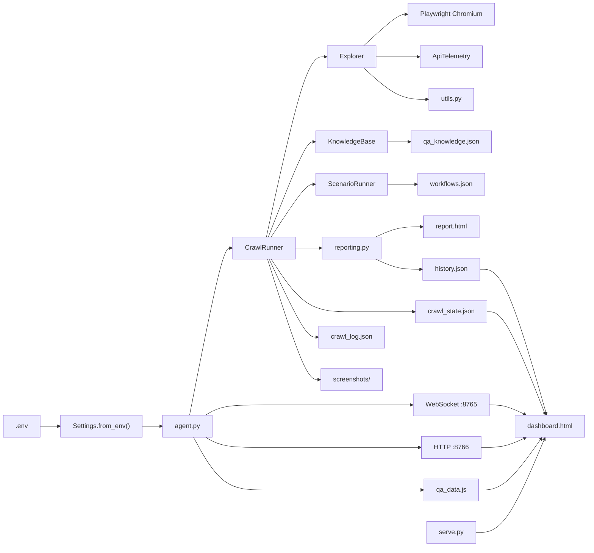

## End-to-End Crawl Sequence

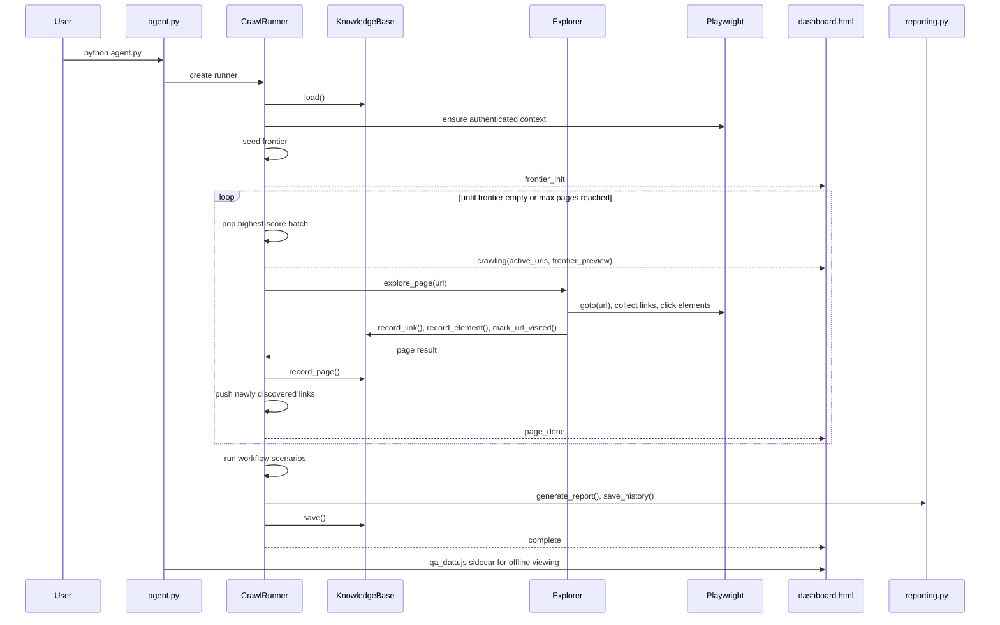

## Frontier, Novelty, Score, Distance, and Cost

This is the part most people ask about.

### Important Accuracy Note

The crawler is "Dijkstra-style", not a literal shortest-path solver over the full site graph.

What the code actually does:

- maintain a priority queue of URLs
- calculate a utility score for each URL
- pop the highest-score URLs first
- apply strict canonical-route dedupe before enqueueing
- show the inverse of score as "cost" in the dashboard for easier map-style explanation

So:

- the real crawl decision is driven by `score`
- the frontier is filtered by canonical-route dedupe before score matters
- dashboard "cost" is a display transform
- the map visualization is explanatory UI, not a separate pathfinding engine

### Route Dedupe Policy

Current default policy:

- one canonical route is crawled at most once per run
- non-seed routes that were already visited in earlier runs are not enqueued again
- seed routes are revisited each run so the explorer can still discover brand-new URLs

Why this exists:

- URL-level dedupe alone is not enough for dynamic apps
- `/project/123` and `/project/456` used to count as different URLs even though they represent the same route shape
- that caused wasteful repeat crawling with little new information

Current seed routes:

- routes from `QA_DISCOVERY_SEED_ROUTES`
- the authenticated start route for the current run
- `/dashboard`

Seed matching is prefix-based on canonical routes:

- `/project-details` matches `/project-details/:id` and deeper canonical children
- `/project-details/:id` matches that dynamic detail route family
- `/` is treated specially and only matches the homepage

So the explorer now behaves like this:

- revisit a very small number of discovery hubs
- only crawl brand-new canonical routes outside that hub set
- leave regression rechecks to workflows instead of broad explorer revisits

### Route Novelty

`RouteKnowledge.novelty_score` in `qa_agent/knowledge.py` calculates how much remains to learn about a canonical route.

Formula:

```text
if visit_count == 0:
    novelty = 10.0
else:
    visit_penalty   = min(visit_count / MAX_ROUTE_VISITS, 1.0) * 4.0
    discovery_bonus = increase in element_count_history, capped at 3.0
    unvisited_bonus = min(len(unvisited_links) * 0.3, 2.0)
    score_stability = abs(avg_score - 5.0) * 0.2

    raw = 10.0 - visit_penalty + discovery_bonus + unvisited_bonus - score_stability
    novelty = clamp(raw, 0.0, 10.0)
```

Interpretation:

- more visits lower novelty
- finding more elements again raises novelty
- pending uncrawled links raise novelty
- routes that look stable and boring fall over time

### URL Score

`KnowledgeBase.score_url` in `qa_agent/knowledge.py` calculates the actual crawl priority.

Formula:

```text
if url not in global_visited:
    base = 10.0
elif route not in KB:
    base = 8.0
else:
    base = route.novelty_score

bonus = 0.0
if route.avg_score < 5.0:
    bonus += 1.5
bonus += min(len(route.unvisited_links) * 0.2, 2.0)
if route.is_exhausted:
    bonus -= 3.0

score = max(0.0, base + bonus)
```

Interpretation:

- brand new URLs are always strongest candidates
- unhealthy routes get rechecked sooner
- routes with pending sub-links stay alive
- exhausted routes are pushed down

### Dashboard Cost / Distance

`CrawlRunner._frontier_preview` and `CrawlRunner._selection_payload` in `qa_agent/runner.py` convert score to dashboard cost:

```text
cost = max(0.0, 10.0 - score)
```

Meaning:

- high score -> low cost
- low score -> high cost

The dashboard uses lower-is-better because people intuitively understand "shortest route" faster than "highest utility".

### Frontier Lifecycle

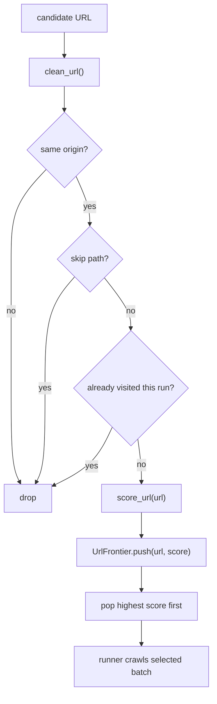

### Strict Dedupe Flow

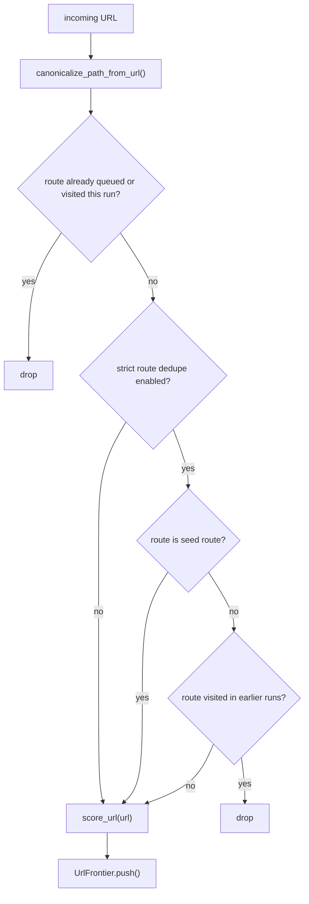

## How New Paths Are Found

New paths come from `Explorer`, not from the dashboard.

### Passive discovery

When a page first loads, `Explorer.explore_page` calls `_discover_links`.

That method scans:

- `a[href]`
- `[data-href]`
- `[router-link]`
- `[to]`

Then it:

- normalizes URLs with `clean_url`
- keeps only same-origin URLs
- records them in the knowledge base with `KnowledgeBase.record_link`

### Active discovery after interaction

The bigger discovery moment happens inside `Explorer._click_all`.

For each clicked element:

1. capture state before click
2. click the element
3. classify the outcome
4. if the click caused navigation, call `_discover_links` again on the new page
5. record those URLs as newly discovered links

Only `navigation` outcomes produce link discovery in that interaction loop.
Modal opens and DOM mutations raise element priority, but they do not automatically create URL frontier entries unless real URLs are found.

### Canonical route grouping

The system stores route knowledge by canonical route, not raw URL.

`canonicalize_path_from_url` in `qa_agent/utils.py` turns dynamic segments into `:id`.

Examples:

- `/project/123` -> `/project/:id`
- `/project/550e8400-e29b-41d4-a716-446655440000/settings` -> `/project/:id/settings`
- `/orders/01JABCDEF1234567890XYZ` -> `/orders/:id`

This matters because:

- knowledge is reused across many concrete URLs
- workflows can target dynamic routes
- route-level novelty is stable even when the app uses generated IDs

### Re-injection into future runs

New links are useful only if they survive the current run.

That persistence chain is:

1. `Explorer` finds the URL
2. `KnowledgeBase.record_link` stores it under `known_links`
3. if globally unvisited, it also stores it under `unvisited_links`
4. `CrawlRunner._inject_kb_frontier` loads those `unvisited_links` at the next run start
5. `CrawlRunner._push_url` scores and queues them

Important consequence under strict route dedupe:

- a previously discovered URL is only useful next run if its canonical route is still new
- if the canonical route is already known, the URL is ignored unless that route is a seed route
- this is intentional, because workflows now carry the regression-check responsibility

### Path Discovery Flow

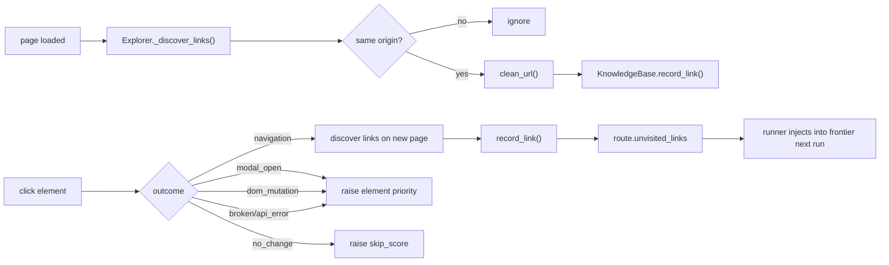

## How Element Learning Works

Element memory lives in `ElementRecord`.

Each element tracks:

- route
- text
- selector
- outcomes
- discovered URLs
- priority
- skip_score
- broke history

Update rules:

- `navigation`, `modal_open`, `dom_mutation`
  - priority +0.6
  - skip_score reset to 0
- `broken`, `api_error`
  - priority -0.2
  - skip_score reset to 0
- `timeout`
  - priority -0.1
- `no_change`
  - skip_score +1
  - priority -0.08

Skip rule:

```text
should_skip when:
    skip_score >= 3
    and priority < 1.5
    and element never broke something
```

Click ordering inside `Explorer._collect_clickables`:

1. new elements
2. known high-priority elements
3. remaining known elements
4. skippable elements are omitted

## Explorer vs Workflow Architecture

### Explorer

- broad
- adaptive
- route-oriented
- designed to discover new states

### Workflow

- narrow
- explicit
- business-journey-oriented
- designed to fail loudly and predictably

### Explorer Architecture

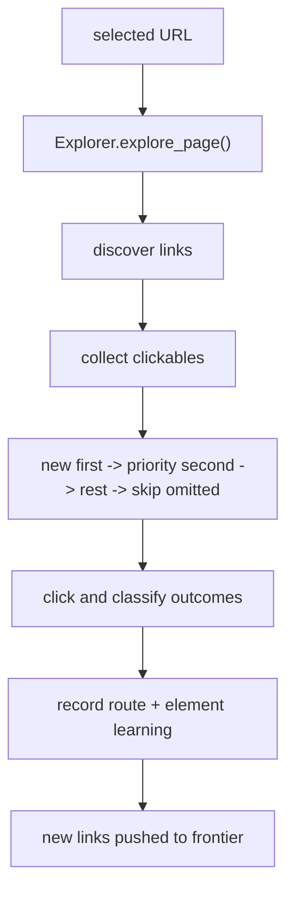

### Workflow Recording Architecture

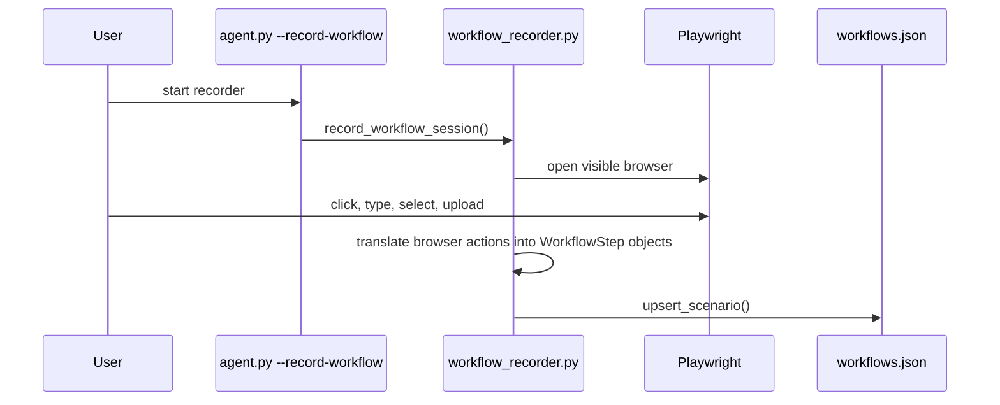

### Guided Tour Seeding Architecture

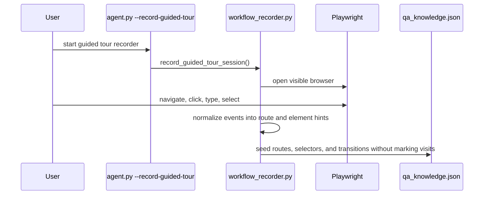

### Workflow Execution Architecture

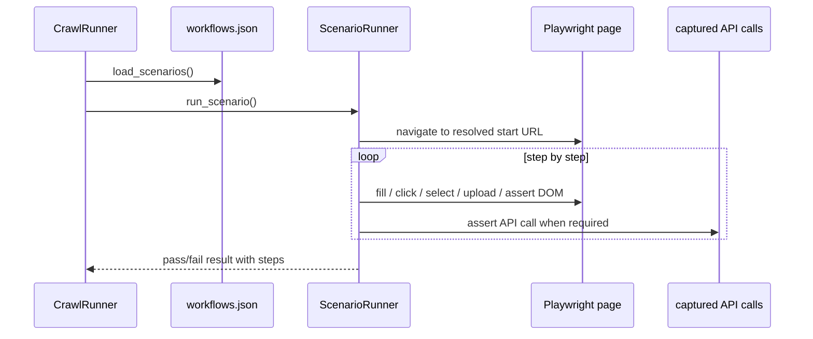

## Retries and Rechecks

Retry logic is owned by `CrawlRunner._mark_retry_status`.

Rule:

- if first attempt score is below `retry_threshold`
  - mark retry scheduled
  - remove the URL from `_frontier_seen`
  - re-push it into the frontier
- if retry also scores low
  - classify as persistent
- if retry succeeds after failing
  - classify as flaky

This is separate from route novelty.
Retry is a quality recheck, not a discovery mechanism.

Under strict route dedupe:

- explorer retries are suppressed
- pages are not re-enqueued just because they scored badly
- this keeps explorer mode discovery-focused and leaves repeated correctness checks to workflows

## Reporting and Artifact Pipeline

Reporting is driven from `qa_agent/reporting.py`.

Artifacts and owners:

| File | Producer | Consumer | Purpose |
| --- | --- | --- | --- |
| `crawl_state.json` | `CrawlState.save_snapshot` | `agent.py`, `dashboard.html`, `serve.py` | resumable state and dashboard hydration |
| `crawl_log.json` | `CrawlRunner.run` | developers | raw page-level evidence |
| `report.html` | `generate_report` | developers | triage and fix-oriented QA report |
| `history.json` | `save_history` | `dashboard.html`, developers | trend and delta tracking |
| `qa_knowledge.json` | `KnowledgeBase.save` / guided-tour recorder | next crawl, dashboard | cross-run exploration memory plus optional seeded tour hints |
| `workflows.json` | workflow recorder / manual edits | `ScenarioRunner` | explicit regression definitions |
| `qa_data.js` | `agent.py::_write_sidecar` | `dashboard.html` | offline dashboard hydration |
| `screenshots/` | `Explorer._shot` | report, developers | visual evidence |

### Reporting Flow

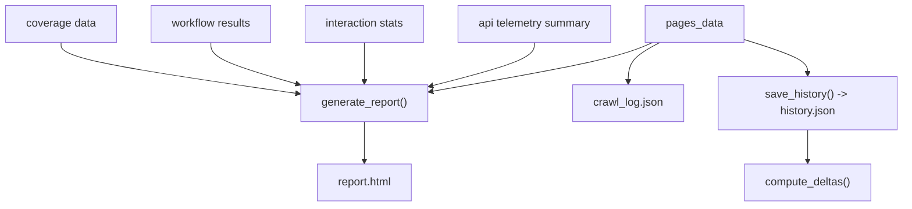

## Dashboard Architecture

The dashboard has 3 data modes:

1. live WebSocket mode while `agent.py` is running
2. HTTP JSON hydration from `crawl_state.json` and `history.json`
3. offline sidecar mode via `qa_data.js`

### Dashboard Data Flow

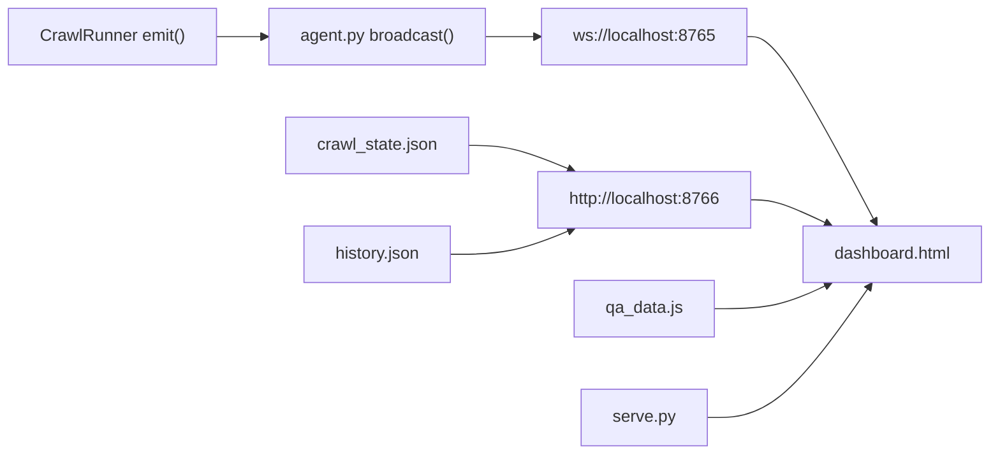

Important dashboard events:

- `frontier_init`
  - initial KB summary and frontier preview
- `crawling`
  - active batch, selected routes, queue size
- `page_done`
  - per-page result, explorer metadata, updated frontier
- `workflow_done`
  - workflow result
- `complete`
  - final summaries, history, deltas, KB summary

## Environment Variables

These come from `Settings.from_env()`.

| Variable | Meaning | Default |
| --- | --- | --- |
| `QA_BASE_URL` | target app base URL | `https://example.com` |
| `QA_START_PATH` | authenticated landing path used for session verification and initial seeding | `/dashboard` |
| `QA_EMAIL` | login email | empty |
| `QA_PASSWORD` | login password | empty |
| `QA_LOGIN_URL` | exact login URL to open before auth | empty |
| `QA_LOGIN_PATHS` | fallback login path candidates, tried in order | `/auth/sign-in,/login,/sign-in,/signin` |
| `QA_AUTH_SUCCESS_PATHS` | URL markers treated as authenticated destinations | `/dashboard,/project` |
| `QA_AUTH_BLOCKING_PATHS` | URL markers treated as still on auth pages | `/auth/,/login,/signin,/sign-in,/verify,/otp,/forgot-password,/reset-password` |
| `QA_MAX_PAGES` | crawl page cap | `300` |
| `QA_PUBLIC_CRAWL` | enable the pre-auth/public crawl phase before login | `1` |
| `QA_PUBLIC_MAX_PAGES` | page cap reserved for the public phase | `40` |
| `QA_PUBLIC_ROUTES` | comma-separated public seed routes opened without a saved session | `/,/auth/sign-in,/auth/sign-up,/auth/forgot-password,/forgot-password` |
| `QA_PARALLEL` | parallel page limit | `10` |
| `QA_STRICT_ROUTE_DEDUPE` | only crawl a canonical route once per run and skip globally known non-seed routes | `1` |
| `QA_DISCOVERY_SEED_ROUTES` | comma-separated routes revisited each run to discover new URLs | `/,/dashboard` |
| `QA_LLM_PROVIDER` | provider selection (`auto`, `ollama`, `openai_compatible`) | `auto` |
| `QA_LLM_URL` | chat completions endpoint | `http://localhost:11434/v1/chat/completions` |
| `QA_LLM_MODEL` | default model for analysis and reporting | `qwen2.5:14b` |
| `QA_LLM_ANALYSIS_MODEL` | optional override for page analysis | empty |
| `QA_LLM_REPORT_MODEL` | optional override for report generation | empty |
| `QA_LLM_API_KEY` | bearer token for cloud providers | empty |
| `QA_LLM_REPORTING` | enable the LLM-generated report handoff | on |
| `OLLAMA_URL` | legacy alias for `QA_LLM_URL` | `http://localhost:11434/v1/chat/completions` |
| `OLLAMA_MODEL` | legacy alias for `QA_LLM_MODEL` | `qwen2.5:14b` |
| `QA_SLACK_WEBHOOK` | Slack alert webhook | empty |
| `QA_LLM_DEBUG` | enable LLM debug logging | off |
| `QA_SCENARIOS` | run workflows after crawl | on |
| `QA_LANGGRAPH` | optional LangGraph support | off |
| `QA_WORKFLOWS_FILE` | workflow definition file | `workflows.json` |

Note:

- the code reads `QA_SLACK_WEBHOOK`, not `SLACK_WEBHOOK`
- `QA_PARALLEL` affects page concurrency in the crawl loop and dashboard active-batch display
- strict route dedupe is on by default because explorer and workflow responsibilities are separate
- the runner now executes `public` then `authenticated` phases; `--resume` skips the public phase to avoid replaying mixed-context pages

## Practical Answers To Common Questions

### Who calculates score?

`KnowledgeBase.score_url`.

### Who calculates novelty?

`RouteKnowledge.novelty_score`.

### Who calculates dashboard cost/distance?

`CrawlRunner._frontier_preview` and `CrawlRunner._selection_payload`.

### Who finds new paths?

`Explorer._discover_links` plus navigation-triggered rediscovery inside `Explorer._click_all`.

### Who stores newly found paths for future runs?

`KnowledgeBase.record_link`.

### Who injects those paths back into the next run?

`CrawlRunner._inject_kb_frontier`.

### Why don't we revisit every known route anymore?

Because that burns time without widening coverage.

The updated policy is:

- explorer revisits only seed hubs to find fresh URLs
- explorer skips globally known non-seed routes
- workflows handle repeated business-path verification

### Who decides which elements to skip?

`ElementRecord.should_skip` and `KnowledgeBase.elements_to_skip`.

### Who decides what to click first?

`Explorer._collect_clickables`.

### Who decides whether a route is exhausted?

`RouteKnowledge.is_exhausted`.

### Who decides retries?

`CrawlRunner._mark_retry_status`.

### Who generates the fix-oriented HTML report?

`generate_report` in `qa_agent/reporting.py`.

### Who pushes live data to the dashboard?

`agent.py::broadcast` and the event payloads emitted by `CrawlRunner`.

## Current Limits

These are real limitations of the current implementation:

- the frontier is priority-queue based, not a full graph shortest-path solver
- dashboard distance is a visualization transform of score, not a separate planning algorithm
- workflows do not self-mutate
- explorer learning is heuristic, not semantic understanding
- only same-origin links are frontier candidates
- URLs matching skip path fragments are excluded

That is acceptable for the current product shape, but it should be documented clearly so people do not over-interpret the "Dijkstra-style" wording.
